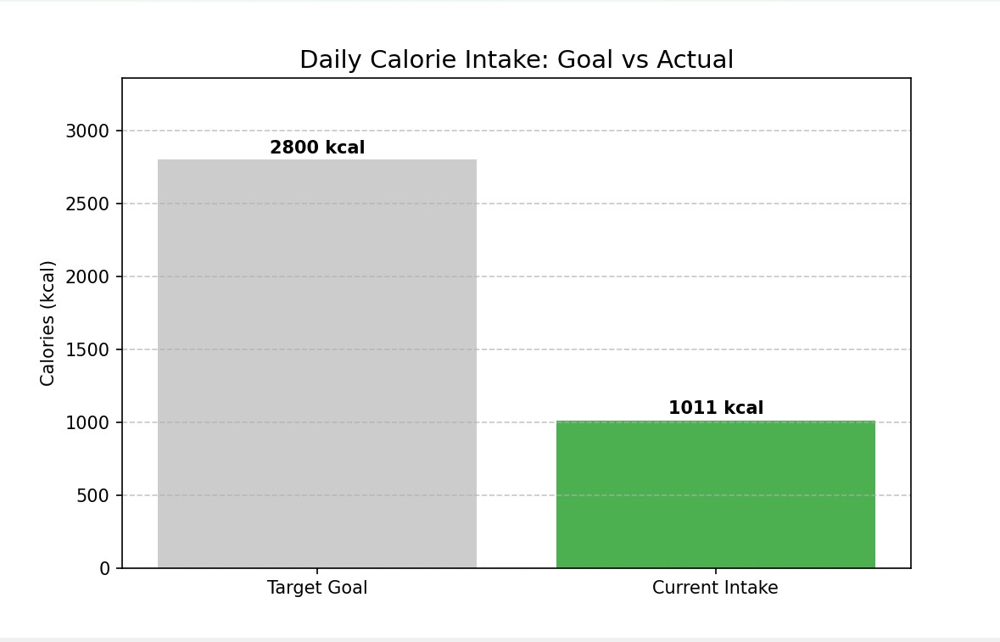

# Calorie Analytics Assistant Bot

A CLI-based fitness assistant designed as an MVP to track daily nutrition, manage recipes, and provide visual analytics using Python and MySQL.

## Project Status: MVP
Current version includes core functionality for data entry and reporting. 
- **Note**: Features like editing or deleting entries are currently under development.
- **Future Roadmap**: Integration with the OpenFoodFacts API for automated product database population.

## Key Features
- Food Management: Add simple products or complex composite dishes (recipes).
- Consumption Logging: Track daily intake with automatic nutritional calculations.
- Advanced Analytics: SQL-driven daily reports based on high-performance Database Views.
- Visual Insights: 
  - Macronutrients distribution charts (Protein/Fat/Carbs).
  - "Goal vs Actual" calorie tracking bars.

## Visualizations

*Example of the Bar Chart showing Goal vs Actual intake.*

## Tech Stack
- Language: Python 3.x
- Database: MySQL 8.0
- Libraries: mysql-connector-python, matplotlib

## Project Structure
- `sql/`: Database schema, seed data, and analytics layer.
- `src/main.py`: Main entry point and CLI logic.
- `src/db_handler.py`: Database connection and CRUD operations.
- `src/chart.py`: Data visualization module.
- `docs/`: Database schema diagrams and visual reports.

## Installation and Launch

### 1. Database Setup
Execute SQL scripts in the `sql/` folder in the following order:
1. `01_schema_init.sql`
2. `02_seed_data.sql`
3. `03_analytics_layer.sql`

### 2. Environment Setup
Install required libraries:
```bash
pip install -r requirements.txt

## Example Commands

Below are the primary commands to interact with the bot. Enter these commands at the "Enter a command:" prompt.

### 1. Database Management
- `add-food`: Starts a step-by-step process to add a new item. You will be asked if it's a simple product or a composite dish (recipe).
- `add-recipe`: Use this to link ingredients to an existing composite dish. You will need to provide the dish name, ingredient name, and weight.

### 2. Daily Tracking
- `eat`: Log your food consumption. Requires the name of the food and the amount consumed in grams.
- `report`: Generates a detailed text-based table of everything you consumed today, including a breakdown of Protein, Fats, and Carbs.

### 3. Analytics and Visualization
- `status`: Displays a bar chart comparing your current calorie intake against your daily target goal (from the database).
- `chart`: Generates a pie chart showing the percentage distribution of macronutrients for the current day.

### 4. System Commands
- `hello`: Check if the bot is responsive.
- `exit` or `close`: Safely close the database connection and exit the application.